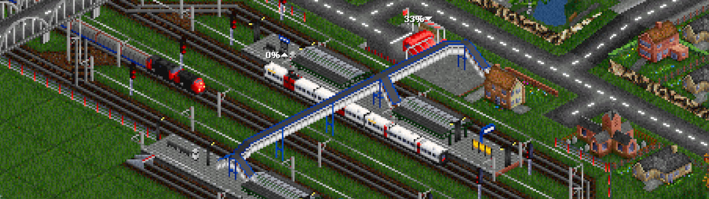

# Transport Madness Kata

This is a kata inspired by Transport Tycoon Kata by SoftwarePark. You can find the original
one [here](https://github.com/Softwarepark/exercises/blob/master/transport-tycoon.md)

<kbd>  </kbd>

It will include several exercises to create a nice transport simulation. Feel free to fork it and do them on your own
with your own preferred language.

All exercises will be published in `master` and a branch with
my [solution](https://github.com/caay2000/transport-madness-kata/tree/solution) (_in Kotlin_) will be published after a
while. You can always check my solution for guidance or propose improvements/discussion in the issues section. I'll
answer as soon as I can.

## Motivation

I was interested in Transport Tycoon Kata by SoftwarePark, and created my version of it. I've done it to practice some
architectural principles, but after a while, I wanted to change lots of things and created one branch after another with
no final purpose. It made me feel lost and demotivated, so I decided to do something similar, close to what I wanted,
but starting simple and making it more and more complex with each exercise.

The "final" idea in my head is something similar to Transport Tycoon, where there is a map with cities and industries,
where you deliver goods from one place to another using trains, trucks or other transport methods. Each transport method
will have its vehicles and paths (railways, highways...)

So, let's start doing some exercises and have fun!

## Transport Madness Exercises

### [Exercise 1 - Start](readme/exercise-1.md)

Create a simple map with a vehicle that moves from one point to another

### [Exercise 2 - Routes I](readme/exercise-2.md)

Assign a route to the vehicle

### [Exercise 3 - Connections I](readme/exercise-3.md)

Create some connections that routes should follow

### [Exercise 4 - Cities I](readme/exercise-4.md)

Create cities in our map that generate passengers

### [Exercise 5 - Transport I](readme/exercise-5.md)

Let's try to put everything together and start moving passengers from one city to another (and an optional visualisation exercise)

### [Exercise 6 - Transport II](readme/exercise-6.md)

Now that we move passengers, let's do it properly, with railcars and trains with engines and different coaches

### [Exercise 7 - Map I](readme/exercise-7.md)

Let's migrate our current map to an amazing hexagonal grid!

### [More to Come](README.md)
