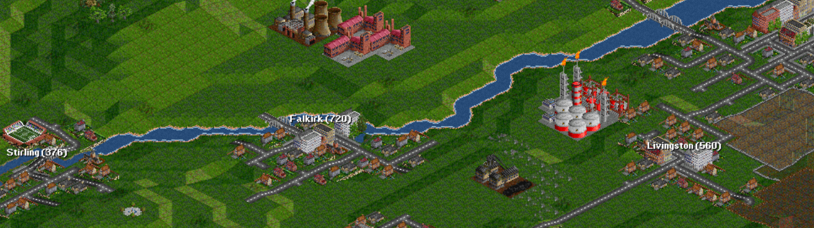

## Exercise 1 - Start

Create a simple map with a vehicle that moves from one point to another

<kbd>  </kbd>

[Home](../README.md) | [Exercise 2 - Routes I](exercise-2.md)

## Summary

Create a 4x6 map and make a vehicle with a route from `(0,0)` (top, left) to `(3,2)`.

Every time the update method on the vehicle is called, the vehicle should do one step towards the destination, so after
5 updates it should be in the final destination `(3,2)`

    |                | data 1 | data 2 |
    |----------------|--------|--------|
    | start position |   0,0  |   0,0  |
    | destination    |   3,2  |   0,4  |
    | turns          |    5   |    4   |

Note that will be interesting to have a predictable algorithm, don't worry about possible obstacles right now

> One way to make the vehicle decide the route is to check for each possible movement which one will be closest to the
> final destination. It's not the best algorithm but will do the trick at the moment. We'll change that in future
> exercises
