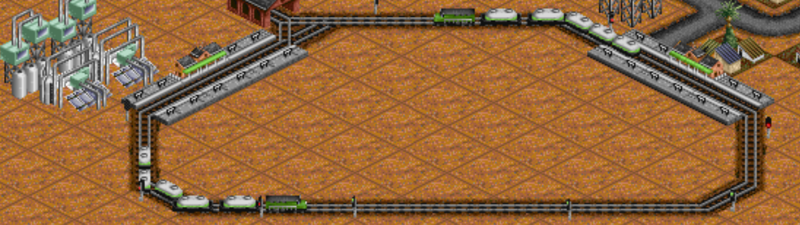

## Exercise 2 - Routes I

Assign a route to the vehicle

<kbd>  </kbd>

[Home](../README.md) | [Exercise 1 - Start](exercise-1.md) | [Exercise 3 - Connections I](exercise-3.md)

## Summary

Now that we have a moving vehicle, let's create a route for it. The idea is to assign a route for the vehicle, for
example A`(0,0)` &rarr; B`(3,2)` &rarr; C`(1,4)` and then back to A

    |   | 0 | 1 | 2 | 3 | 4 | 5 |
    |---|---|---|---|---|---|---|
    | 0 | A | - | - | - | \ |   |
    | 1 | ¦ |   |   |   | C |   |
    | 2 | ¦ |   |   |   | ¦ |   |
    | 3 | \ | _ | B | _ | / |   |

We also want to stay 1 turn at each stop, so the time to complete the route, from A to A again will be:

    |A stop  |  1 turn  |
    |A to B  |  5 turns |
    |B stop  |  1 turn  |
    |B to C  |  4 turns |
    |C stop  |  1 turn  |
    |C to A  |  5 turns |
    |TOTAL   | 17 turns |

You can also try with a circular route repeating some stops, like for example `(0,0)` &rarr; `(3,2)` &rarr; `(1,4)`
&rarr; `(3,2)`. This will take 22 turns to complete
