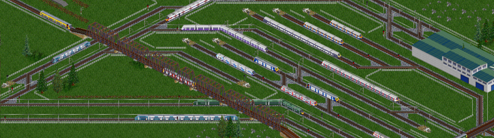

## Exercise 3 - Connections I

Create some connections that routes should follow

<kbd>  </kbd>

[Home](../README.md) | [Exercise 2 - Routes I](exercise-2.md) | [Exercise 4 - Cities I](exercise-4.md)

## Summary

Let's create real connections with real infrastructure. We want to create highways or railways from point to point, and
then allow vehicles just to move on that connections.

Let's create a connection from A`(0,0)` to B`(3,2)` and from B to C`(1,4)`. Then use the same routes as before, from A
&rarr; B &rarr; C (21 turns) and A &rarr; B &rarr; C &rarr; B (22 turns) and check the times

    |   | 0 | 1 | 2 | 3 | 4 |
    |---|---|---|---|---|---|
    | 0 | A | - | - | \ |   |
    | 1 |   |   |   | ¦ |   |
    | 2 |   |   |   | B |   |
    | 3 |   |   |   | ¦ |   |
    | 4 |   | C | - | / |   |

You can also check what happens with the "circular" route (A &rarr; B &rarr; C &rarr; B) when the connection is also
circular (_from A`(0,0)` to B`(3,2)`, from B to C`(1,4)` and from C to A again_)

> You can use any pathfinding algorithm to search for the correct route from point to point. There are multiple implementations out there (_Disjktra, A*..._)
> if you need an A* algorithm implementation in Kotlin, I've put together some implementations I found on the Internet in the following repo [pathfinding-astar-kotlin](https://github.com/caay2000/pathfinding-astar-kotlin)

