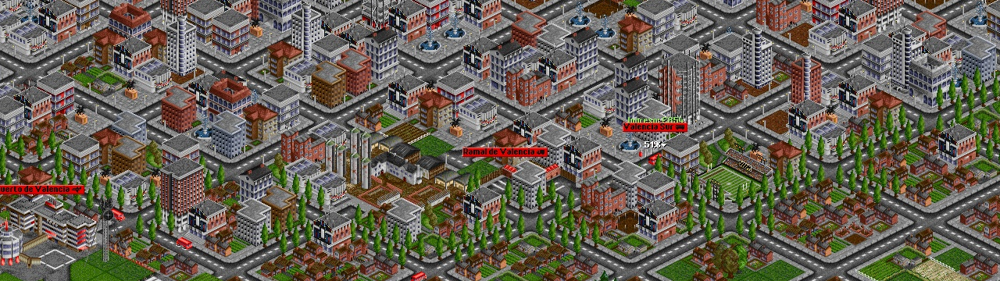

## Exercise 4 - Cities I

Create cities in our map that generate and receive passengers

<kbd>  </kbd>

[Home](../README.md) | [Exercise 3 - Connections I](exercise-3.md)

## Summary

Let's create cities in our maps! In this first stage, we want a city to be positioned in just on x,y coordinate in our
map! These cities will have a random population (> 100) and will generate each turn some passengers to travel between
cities in our world! The ratio will be changed later on, but at the moment we can agree on 0.2% of city population per
turn.

    | CITY SIZE  | 1 turn | 5 turns | 10 turns |
    |------------|--------|---------|----------|
    |      100   |  0 PAX |   0 PAX |    1 PAX |
    |      500   |  1 PAX |   5 PAX |   10 PAX |
    |     1000   |  2 PAX |  10 PAX |   20 PAX |
    |     2500   |  5 PAX |  25 PAX |   50 PAX |

We also want to avoid having 2 cities to close to each other, so we'll need to put some rule to avoid cities with a
distance lower than 6

> I would recommend putting all these variables like `percentage of PAX per turn` or `min distance between cities` to
> be stored in a configuration, so it can be changed easily later on

