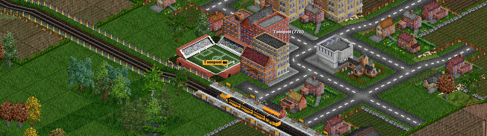

## Exercise 5 - Transport I

Let's try to put everything together and start moving passengers from one city to another

<kbd>  </kbd>

[Home](../README.md) | [Exercise 4 - Cities I](exercise-4.md)

## Summary

We want now to transport passengers from our cities to other cities. The idea will be to create a simple map with some
connected cities, and let the vehicles do their job.

First part of the exercise will be to visualize our network in some way. You can do whatever works for you, but I'll propose 
something quite simple on the console. The same map we have been working with will be represented like this:

```
   0  1  2  3  4  5    
0  H  +  @  +  .  .
1  .  .  .  +  .  .
2  .  .  .  H  .  .
3  .  .  .  +  .  .
4  .  H  +  +  .  .
5  .  .  .  .  .  .

(0,0) 500 population - 2PAX waiting - 3 PAX Received
(3,2) 1000 population - 1PAX waiting - 1 PAX Received
(1,4) 250 population - 0PAX waiting - 2 PAX Received
```

`.` for empty cells (with no connection)
`+` for connected cells
`H` for cities
`@` for our running vehicles

This can be printed each turn to see how our simulation is working


To do this, we're going to create a 30X30 map and put some cities in it

Let's create cities in our maps! In this first stage, we want a city to be positioned in just on x,y coordinate in our
map! These cities will have a random population (> 100) and will generate each turn some passengers to travel between
cities in our world! The ratio will be changed later on, but at the moment we can agree on 0.2% of city population per
turn.

    | CITY SIZE  | 1 turn | 5 turns | 10 turns |
    |------------|--------|---------|----------|
    |      100   |  0 PAX |   0 PAX |    1 PAX |
    |      500   |  1 PAX |   5 PAX |   10 PAX |
    |     1000   |  2 PAX |  10 PAX |   20 PAX |
    |     2500   |  5 PAX |  25 PAX |   50 PAX |

We also want to avoid having 2 cities to close to each other, so we'll need to put some rule to avoid cities with a
distance lower than 6

> I would recommend putting all these variables like `percentage of PAX per turn` or `min distance between cities` to
> be stored in a configuration, so it can be changed easily later on


