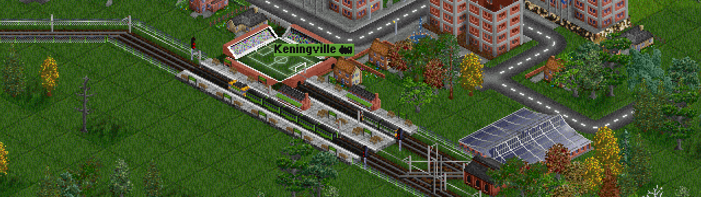

## Exercise 6 - Transport II

Now that we move passengers, let's do it properly, with railcars and trains with engines and different coaches

<kbd>  </kbd>

[Home](../README.md) | [Exercise 5 - Transport I](exercise-5.md)

## Summary

The idea is to have different type of vehicles, and prepare them for an specific amount of max passengers each. First of all
we are going to have 2 different vehicle types, passenger train and a rail-car.

* The passenger train could have up to 3 passengers coaches, each with 20 seats (max of 60 passengers)
* The rail car can handle up to 30 passengers, with no coaches at all.

So lets try this exercise:

With a simple route from 0,0 to 3,0 (each location with population 5000), let's try to do 2 round trips

* Passenger Train (60 Max PAX capacity):

    | LOCATION   | 1 turn              |  4 turn |  5 turn |  8 turn |  9 turn | 12 turn | 13 turn | 16 turn  |              
    |------------|---------------------|---------|---------|---------|---------|---------|---------|----------|
    |    (0,0)   | 10 PAX / 0 Received | 30 /  0 | 40 /  0 | 70 / 50 | 20 / 50 | 50 / 50 | 70 / 50 | 90 / 110 | 
    |    (3,0)   | 10 PAX / 0 Received | 40 / 10 |  0 / 10 | 30 / 10 | 40 / 10 | 70 / 70 | 20 / 70 | 50 /  70 |

* Rail Car (30 Max PAX capacity):

    | LOCATION   | 1 turn              |  4 turn |  5 turn |  8 turn |  9 turn | 12 turn | 13 turn | 16 turn  |              
    |------------|---------------------|---------|---------|---------|---------|---------|---------|----------|
    |    (0,0)   | 10 PAX / 0 Received | 30 /  0 | 40 /  0 | 70 / 30 | 50 / 30 | 80 / 30 | 90 / 30 | 120 / 60 | 
    |    (3,0)   | 10 PAX / 0 Received | 40 / 10 | 20 / 10 | 50 / 10 | 60 / 10 | 90 / 40 | 70 / 40 | 100 / 40 |
