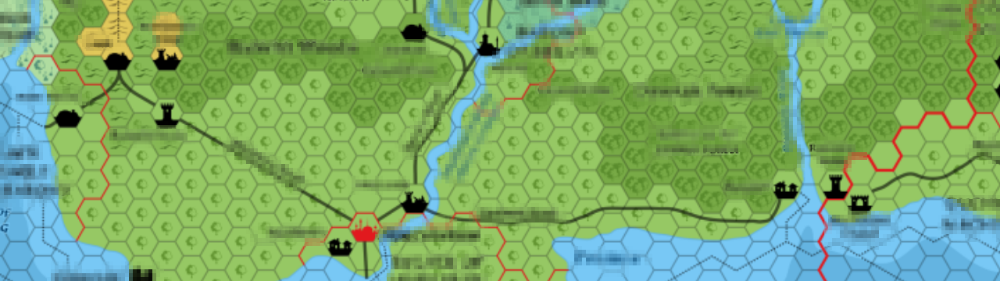

## Exercise 7 - Map I

Let's migrate our current map to an amazing hexagonal grid!

<kbd>  </kbd>

[Home](../README.md) | [Exercise 6 - Transport Types I](exercise-6.md)

## Summary

So, looking at our current map, it's not realistic to have 90 degrees turns for our connections. So let's try to use an
hexagonal grid that will allow us smoother turns and will change our current timings.

You can read anything you need about hexagonal grids in [here](https://www.redblobgames.com/grids/hexagons/), an amazing
page from [@redblobgames](https://github.com/redblobgames) where you can learn a lot about algorithms, not only about
hexagonal grids!

Following Amit's page I will use an _“odd-r” horizontal layout_ in an offset coordinates

The exercise will be to change our current squared grid for a hexagonal grid, and try to visualise it! I will propose
the following visualisation:

         . . . . . . .
          . . . . . . .
         . . . . . . .
          . . . . . . .
         . . . . . . .
          . . . . . . .
         . . . . . . .

So, the result for our exercise - 5 with A(0,0) B at (2,3) and C at (1,4) and connections between them, will have this final snapshot

        WORLD CURRENT TURN -> 18
          0 1 2 3
        0 @ x x . 
        1  x . x . 
        2 x . . O 
        3  x . x . 
        4 . O x . 
        5  . . . . 
        (0, 0) 500 population - 17PAX waiting - 16 PAX Received
        (3, 2) 1000 population - 8PAX waiting - 6 PAX Received
        (1, 4) 250 population - 4PAX waiting - 12 PAX Received

Another example with a bigger map (40x40) could be the following one:

* Connection from 8,4 to 5,25 and also from 8,4 to 20,25
* More connections are from 20,25 to 35,5 and again from 20,25 to 35,35
* Entity route is A -> B -> A -> C -> D -> C -> E -> C
* You can check population for each location below
* Play a little with it, with different maps, and even, with multiple entities running at the same time!

        WORLD CURRENT TURN -> 186
        . . . . . . . . . . . . . . . . . . . . . . . . . . . . . . . . . . . . . . . .
         . . . . . . . . . . . . . . . . . . . . . . . . . . . . . . . . . . . . . . . .
        . . . . . . . . . . . . . . . . . . . . . . . . . . . . . . . . . . . . . . . .
         . . . . . . . . . . . . . . . . . . . . . . . . . . . . . . . . . . . . . . . .
        . . . . . . . . @ x x . . . . . . . . . . . . . . . . . . . . . . . . . . . . .
         . . . . . . . x . . x . . . . . . . . . . . . . . . . . . . . . . . . D . . . .
        . . . . . . . x . . . x . . . . . . . . . . . . . . . . . . . . . . . x . . . .
         . . . . . . x . . . . x . . . . . . . . . . . . . . . . . . . . . . x . . . . .
        . . . . . . x . . . . . x . . . . . . . . . . . . . . . . . . . . . x . . . . .
         . . . . . x . . . . . . x . . . . . . . . . . . . . . . . . . . . x . . . . . .
        . . . . . x . . . . . . . x . . . . . . . . . . . . . . . . . . . x . . . . . .
         . . . . x . . . . . . . . x . . . . . . . . . . . . . . . . . . x . . . . . . .
        . . . . x . . . . . . . . . x . . . . . . . . . . . . . . . . . x . . . . . . .
         . . . x . . . . . . . . . . x . . . . . . . . . . . . . . . . x . . . . . . . .
        . . . x . . . . . . . . . . . x . . . . . . . . . . . . . . . x . . . . . . . .
         . . x . . . . . . . . . . . . x . . . . . . . . . . . . . . x . . . . . . . . .
        . . x . . . . . . . . . . . . . x . . . . . . . . . . . . . x . . . . . . . . .
         . x . . . . . . . . . . . . . . x . . . . . . . . . . . . x . . . . . . . . . .
        . . x . . . . . . . . . . . . . . x . . . . . . . . . . . x . . . . . . . . . .
         . . x . . . . . . . . . . . . . . x . . . . . . . . . . x . . . . . . . . . . .
        . . . x . . . . . . . . . . . . . . x . . . . . . . . . x . . . . . . . . . . .
         . . . x . . . . . . . . . . . . . . x . . . . . . . . x . . . . . . . . . . . .
        . . . . x . . . . . . . . . . . . . . x . . . . . . . x . . . . . . . . . . . .
         . . . . x . . . . . . . . . . . . . . x . . . . . . x . . . . . . . . . . . . .
        . . . . . x . . . . . . . . . . . . . . x . . . . . x . . . . . . . . . . . . .
         . . . . . B . . . . . . . . . . . . . . C x x x x x x x x x x . . . . . . . . .
        . . . . . . . . . . . . . . . . . . . . . . . . . . . . . . . x . . . . . . . .
         . . . . . . . . . . . . . . . . . . . . . . . . . . . . . . . x . . . . . . . .
        . . . . . . . . . . . . . . . . . . . . . . . . . . . . . . . . x . . . . . . .
         . . . . . . . . . . . . . . . . . . . . . . . . . . . . . . . . x . . . . . . .
        . . . . . . . . . . . . . . . . . . . . . . . . . . . . . . . . . x . . . . . .
         . . . . . . . . . . . . . . . . . . . . . . . . . . . . . . . . . x . . . . . .
        . . . . . . . . . . . . . . . . . . . . . . . . . . . . . . . . . . x . . . . .
         . . . . . . . . . . . . . . . . . . . . . . . . . . . . . . . . . . x . . . . .
        . . . . . . . . . . . . . . . . . . . . . . . . . . . . . . . . . . . x . . . .
         . . . . . . . . . . . . . . . . . . . . . . . . . . . . . . . . . . . E . . . .
        . . . . . . . . . . . . . . . . . . . . . . . . . . . . . . . . . . . . . . . .
         . . . . . . . . . . . . . . . . . . . . . . . . . . . . . . . . . . . . . . . .
        . . . . . . . . . . . . . . . . . . . . . . . . . . . . . . . . . . . . . . . .
         . . . . . . . . . . . . . . . . . . . . . . . . . . . . . . . . . . . . . . . .
        (8, 4) 500 population - 141PAX waiting - 67 PAX Received
        (5, 25) 1000 population - 326PAX waiting - 1 PAX Received
        (20, 25) 250 population - 12PAX waiting - 164 PAX Received
        (35, 5) 500 population - 126PAX waiting - 34 PAX Received
        (35, 35) 750 population - 219PAX waiting - 26 PAX Received

