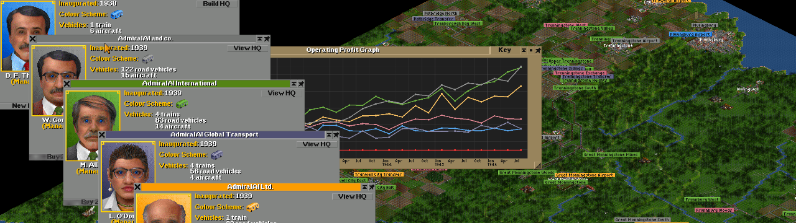

## Exercise 8 - Companies I

What about other people wanting to create their own transport madness net? Let's create companies for everyone!

<kbd>  </kbd>

[Home](../README.md) | [Exercise 7 - Map I](exercise-7.md) | [Exercise 9 - Money I](exercise-9.md)

## Summary

Like in transport tycoon game, we want to have multiple "companies" playing our simulation, each one with its own
routes, vehicles and anything a company needs. So to start with it, we want that each company has its own connections
and entities, and won't be able to use connections from other companies.

For this first iteration, we don't want that the same cell has connections from different companies, but cities. So only
cities can be connected by multiple companies!

Let's do it!

To validate it you can create the following scenario in a 10x10 map:

```
        . . . . . . . . . .
         . A x x x x x x B .
        . x . . . . . . . x
         x . . . . . . . . x
        x . . . . . . . . x
         x . . . . . . . . x
        x . . . . . . . . x
         x . . . . . . . x .
        . C x x x x x x D .
         . . . . . . . . . .
         
        (1, 1) 500 population 
        (8, 1) 1000 population 
        (1, 8) 250 population 
        (8, 8) 250 population 
```

There will be 2 different companies. The first one (`Company A`, owns the straight connection between A and B, while the
other one(`Company B`), needs to go through C and D to reach B. `Company A` does not have any train, but `Company B` has
a train deployed in A, with a route to B.

It should do all the path from A to B via C and D, and it will take 44 turns (stop in B included) to go and return to A