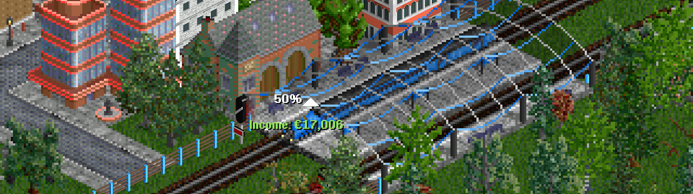

## Exercise 9 - Money I

Some people say... everything is about money! So let's add money to our companies!!!

<kbd>  </kbd>

[Home](../README.md) | [Exercise 8 - Companies I](exercise-8.md)

## Summary

We want to receive money for each delivery! The amount received will be the distance between 2 stations * 100,
regardless of the time spent for the trip (we'll change that later). So, in the example of exercise 8, from A to B,
we'll receive 8*100=800, regardless of the time spent!

```
        . . . . . . . . . .
         . A x x x x x x B .
        . x . . . . . . . x
         x . . . . . . . . x
        x . . . . . . . . x
         x . . . . . . . . x
        x . . . . . . . . x
         x . . . . . . . x .
        . C x x x x x x D .
         . . . . . . . . . .
         
        (1, 1) 500 population 
        (8, 1) 1000 population 
        (1, 8) 250 population 
        (8, 8) 250 population 
```

Let's create one vehicle for each company, with the route from A to B, and see how much money they received in turn 100!